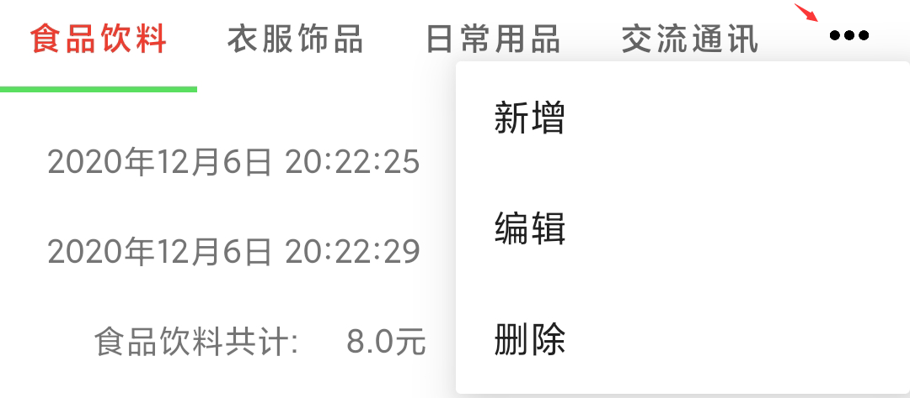
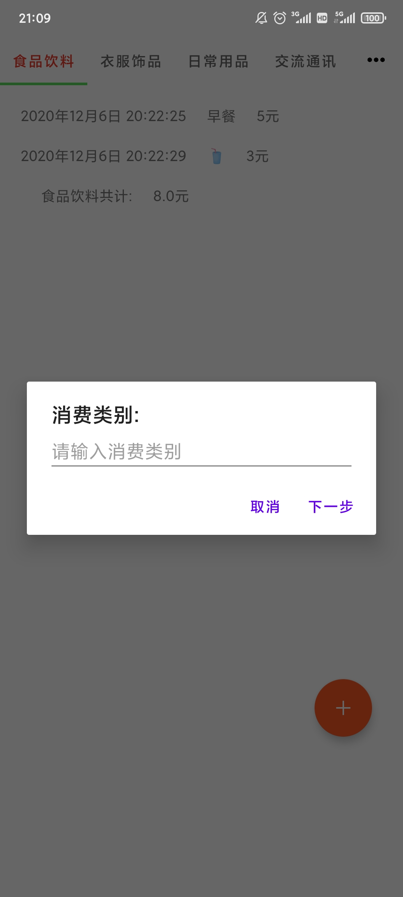

APP为简单的记账软件 

所有数据均以长字符串的形式(用,隔开)通过 SharedPreferences 储存

目前支持：

1.对不同的消费情景进行添加/编辑/删除消费类别

  点击menu 可展开三种操作 新增 编辑 删除

  新增是添加消费类别
  
  
  编辑可以修改title
  
  
  删除可以删除pager
  
  
  
  
  
  
  
  
2.可点击 加号 在不同消费类别下添加账单

  且每次添加都会在最后一项出现 title+共计：+该消费类别账单的总金额 
  
  
  
  
  
  
  
  
  
  暂不支持对添加的账单里的内容进行修改和删除
  
  
  
3.进行以上操作后界面内容都会得到对应的刷新并且对数据进行保存

  当再次打开APP时 所有界面内容会初始化为 上次退出前的状态
  
  所有修改都能都到保存

